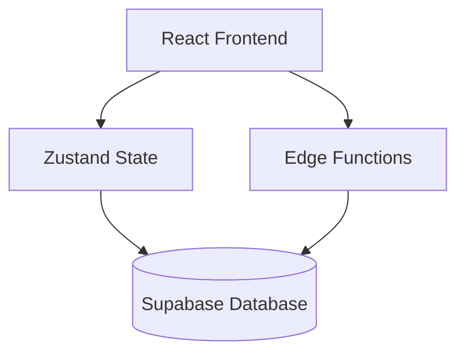

# Graph Strategist Documentation

Welcome to the Graph Strategist documentation. This system helps you build and visualize strategic plans through interactive graph-based modeling.

## Documentation Overview

### Core Documentation
- **[Architecture](./architecture.md)** - System design and technical architecture
- **[User Guide](./user-guide.md)** - How to use Graph Strategist
- **[Database Schema](./database-schema.md)** - Database structure and relationships

### Technical Reference
- **[API Reference](./api-reference.md)** - Edge Functions and API endpoints
- **[Development Guide](./development.md)** - Developer setup and guidelines

## Quick Start

Graph Strategist is a visual strategy planning tool that lets you:
- **Model complex strategies** using nodes and edges
- **Simulate scenarios** with AI-powered analysis
- **Automate workflows** with custom execution pipelines
- **Get AI assistance** through the Co-Pilot

## Key Features

### 🎯 Node Types
- **Goal** (⭐) - What you want to achieve
- **Task** (⚙️) - Steps to reach goals
- **Decision** (🔀) - Branch points in your strategy
- **Signal** (🔔) - Triggers and conditions
- **Outcome** (✅) - Results and milestones
- **Risk** (⚠️) - Potential problems
- **Agent** (🤖) - AI helpers
- **Tool** (🧰) - Connected apps/services

### 🔗 Relationship Types
- **depends_on** - Task dependencies
- **leads_to** - Task to outcome flows
- **triggers** - Signal activation paths
- **branches_to** - Decision branching
- **mitigates** - Risk mitigation
- **uses** - Tool utilization

## System Components

## Getting Help

- Check the [User Guide](./user-guide.md) for how-to instructions
- Review the [Architecture](./architecture.md) for system understanding
- See [API Reference](./api-reference.md) for integration details
- Consult [Development Guide](./development.md) for contribution guidelines
