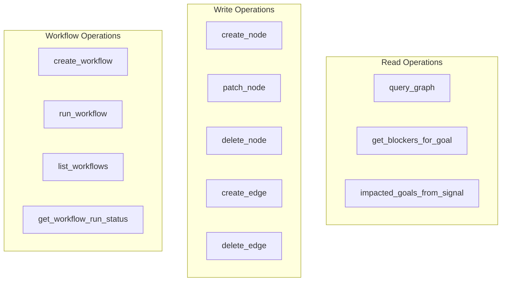
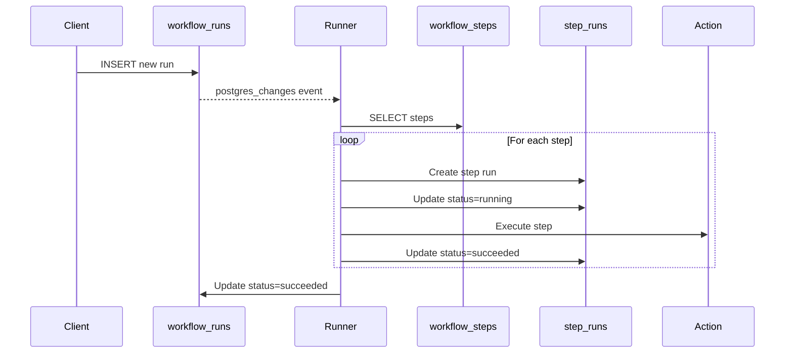
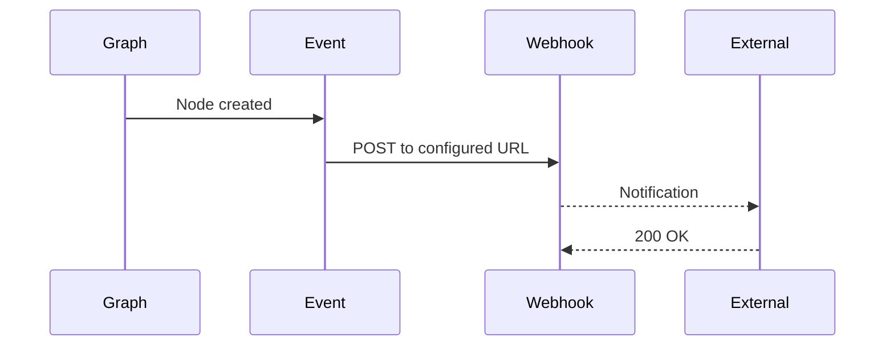

# API Reference

## Overview

Graph Strategist provides several Edge Functions for backend operations. All functions use REST APIs with JSON payloads.

## Base URL

```
https://aalritrcwtocwcjylyfl.supabase.co/functions/v1
```

## Authentication

Most endpoints use public access during development. Production deployments should use JWT authentication:

```http
Authorization: Bearer <jwt_token>
apikey: <supabase_anon_key>
```

## Edge Functions

### graph-api

Main API for node and edge operations.

#### GET /graph-api/graph

Get all nodes and edges.

**Response:**
```json
{
  "nodes": [
    {
      "id": "uuid",
      "label": "goal",
      "props": {
        "name": "Launch Product",
        "description": "...",
        "priority": "high"
      },
      "x": 100,
      "y": 200,
      "created_at": "2025-10-15T..."
    }
  ],
  "edges": [
    {
      "id": "uuid",
      "source": "uuid",
      "target": "uuid",
      "type": "depends_on"
    }
  ]
}
```

#### POST /graph-api/nodes

Create a new node.

**Request:**
```json
{
  "label": "task",
  "props": {
    "name": "Build Feature",
    "description": "Implement the new dashboard",
    "status": "pending"
  }
}
```

**Response:**
```json
{
  "id": "uuid",
  "label": "task",
  "props": { ... },
  "x": 234.5,
  "y": 567.8,
  "created_at": "2025-10-15T..."
}
```

#### PATCH /graph-api/nodes/:id

Update node properties.

**Request:**
```json
{
  "props": {
    "status": "completed",
    "completion_date": "2025-10-15"
  }
}
```

**Response:**
```json
{
  "id": "uuid",
  "label": "task",
  "props": { ... },
  "updated_at": "2025-10-15T..."
}
```

#### DELETE /graph-api/nodes/:id

Delete a node and its connected edges.

**Response:**
```json
{
  "success": true
}
```

#### POST /graph-api/edges

Create an edge between nodes.

**Request:**
```json
{
  "source": "uuid",
  "target": "uuid",
  "type": "depends_on"
}
```

**Response:**
```json
{
  "id": "uuid",
  "source": "uuid",
  "target": "uuid",
  "type": "depends_on",
  "created_at": "2025-10-15T..."
}
```

#### DELETE /graph-api/edges/:id

Delete an edge.

**Response:**
```json
{
  "success": true
}
```

#### GET /graph-api/search

Search nodes by name.

**Query Parameters:**
- `q` - Search query string

**Response:**
```json
[
  {
    "id": "uuid",
    "label": "goal",
    "props": {
      "name": "Launch Product"
    }
  }
]
```

#### GET /graph-api/goals/:id/blockers

Get all risks blocking a goal.

**Response:**
```json
[
  {
    "id": "uuid",
    "label": "risk",
    "props": {
      "name": "Security Vulnerability"
    }
  }
]
```

#### GET /graph-api/signals/:id/impacted-goals

Get goals affected by a signal.

**Response:**
```json
[
  {
    "id": "uuid",
    "label": "goal",
    "props": {
      "name": "User Growth"
    }
  }
]
```

### agent-respond

AI Co-Pilot for graph manipulation.

#### POST /agent-respond

Send a command to the Co-Pilot.

**Request:**
```json
{
  "prompt": "Create a goal called 'Increase Revenue'",
  "messages": [
    {
      "role": "user",
      "content": "Previous message"
    },
    {
      "role": "assistant",
      "content": "Previous response"
    }
  ]
}
```

**Response:**
```json
{
  "message": "Created goal 'Increase Revenue'",
  "actions": [
    {
      "tool": "create_node",
      "args": {
        "label": "goal",
        "name": "Increase Revenue"
      },
      "result": {
        "id": "uuid",
        "label": "goal"
      }
    }
  ]
}
```

**Available Tools:**



### agent-respond-simulation

AI-powered simulation analysis.

#### POST /agent-respond-simulation

Run simulation on graph.

**Request:**
```json
{
  "planId": "default",
  "command": "SIMULATE_ONCE",
  "graph": {
    "nodes": [...],
    "edges": [...]
  },
  "context": {
    "timestamp": "2025-10-15T...",
    "scenario": "User signup flow"
  }
}
```

**Response:**
```json
{
  "trace": [
    {
      "role": "assistant",
      "content": "## Analysis Results\n\n**Bottlenecks:**\n- Decision node 'Is Premium?' has convergence of 3 paths\n\n**Recommendations:**\n- Add error handling for validation..."
    }
  ],
  "deltas": {
    "nodes": [
      {
        "action": "create",
        "node": {
          "label": "task",
          "props": {
            "name": "Handle Validation Errors"
          }
        }
      }
    ]
  }
}
```

### strategy-agent

Strategic planning assistant.

#### POST /strategy-agent

Get strategic insights.

**Request:**
```json
{
  "prompt": "Analyze risks for our launch plan",
  "context": {
    "nodes": [...],
    "edges": [...]
  }
}
```

**Response:**
```json
{
  "insights": [
    {
      "type": "risk_analysis",
      "content": "Identified 3 unmitigated risks...",
      "confidence": 0.85
    }
  ]
}
```

### workflow-api

Workflow management operations.

#### POST /workflow-api/workflows

Create a workflow.

**Request:**
```json
{
  "name": "User Onboarding",
  "description": "Automated onboarding sequence",
  "mode": "SEQUENTIAL",
  "steps": [
    {
      "name": "Send Welcome Email",
      "type": "HTTP_REQUEST",
      "config": {
        "url": "https://api.email.com/send",
        "method": "POST",
        "body": {
          "template": "welcome"
        }
      }
    },
    {
      "name": "Wait 1 Day",
      "type": "DELAY",
      "config": {
        "duration": 86400
      }
    },
    {
      "name": "Mark Onboarded",
      "type": "SET_NODE_PROP",
      "config": {
        "node_id": "uuid",
        "props": {
          "status": "onboarded"
        }
      }
    }
  ]
}
```

**Response:**
```json
{
  "success": true,
  "workflow_id": "uuid",
  "name": "User Onboarding",
  "steps_count": 3
}
```

#### GET /workflow-api/workflows

List all workflows.

**Response:**
```json
{
  "workflows": [
    {
      "id": "uuid",
      "name": "User Onboarding",
      "mode": "SEQUENTIAL",
      "created_at": "2025-10-15T..."
    }
  ]
}
```

#### POST /workflow-api/workflows/:id/execute

Execute a workflow.

**Response:**
```json
{
  "success": true,
  "run_id": "uuid",
  "status": "queued"
}
```

#### GET /workflow-api/runs/:id

Get workflow run status.

**Response:**
```json
{
  "id": "uuid",
  "workflow_id": "uuid",
  "status": "running",
  "started_at": "2025-10-15T...",
  "log": {
    "events": [
      {
        "step": "Send Welcome Email",
        "status": "completed",
        "timestamp": "2025-10-15T..."
      }
    ]
  }
}
```

### workflow-runner

Background service for workflow execution.

**Auto-triggered by workflow_runs table inserts**



## Error Responses

All endpoints return errors in this format:

```json
{
  "error": {
    "message": "Node not found",
    "code": "NOT_FOUND",
    "status": 404
  }
}
```

**Common Error Codes:**

| Code | Status | Description |
|------|--------|-------------|
| NOT_FOUND | 404 | Resource doesn't exist |
| VALIDATION_ERROR | 400 | Invalid request data |
| UNAUTHORIZED | 401 | Missing/invalid auth |
| FORBIDDEN | 403 | Insufficient permissions |
| INTERNAL_ERROR | 500 | Server error |

## Rate Limits

**Development:**
- No rate limits

**Production (Recommended):**
- 100 requests/minute per IP
- 1000 requests/hour per user

## Webhooks (Future Feature)



**Webhook Payload:**
```json
{
  "event": "node.created",
  "timestamp": "2025-10-15T...",
  "data": {
    "node": { ... }
  }
}
```

## SDK Usage Examples

### JavaScript/TypeScript

```typescript
import { createClient } from '@supabase/supabase-js';

const supabase = createClient(
  'https://aalritrcwtocwcjylyfl.supabase.co',
  'your-anon-key'
);

// Create a node
const { data: node } = await supabase.functions.invoke('graph-api/nodes', {
  method: 'POST',
  body: {
    label: 'goal',
    props: { name: 'Launch Product' }
  }
});

// Query graph
const { data: graph } = await supabase.functions.invoke('graph-api/graph');

// Use Co-Pilot
const { data: response } = await supabase.functions.invoke('agent-respond', {
  body: {
    prompt: 'Create a task called Deploy'
  }
});
```

### Python

```python
import requests

BASE_URL = "https://aalritrcwtocwcjylyfl.supabase.co/functions/v1"
API_KEY = "your-anon-key"

headers = {
    "Authorization": f"Bearer {API_KEY}",
    "apikey": API_KEY,
    "Content-Type": "application/json"
}

# Create node
response = requests.post(
    f"{BASE_URL}/graph-api/nodes",
    headers=headers,
    json={
        "label": "task",
        "props": {"name": "Build Feature"}
    }
)

node = response.json()
```

### cURL

```bash
# Get graph
curl -X GET \
  https://aalritrcwtocwcjylyfl.supabase.co/functions/v1/graph-api/graph \
  -H "apikey: your-anon-key"

# Create node
curl -X POST \
  https://aalritrcwtocwcjylyfl.supabase.co/functions/v1/graph-api/nodes \
  -H "apikey: your-anon-key" \
  -H "Content-Type: application/json" \
  -d '{
    "label": "goal",
    "props": {"name": "Launch Product"}
  }'
```
