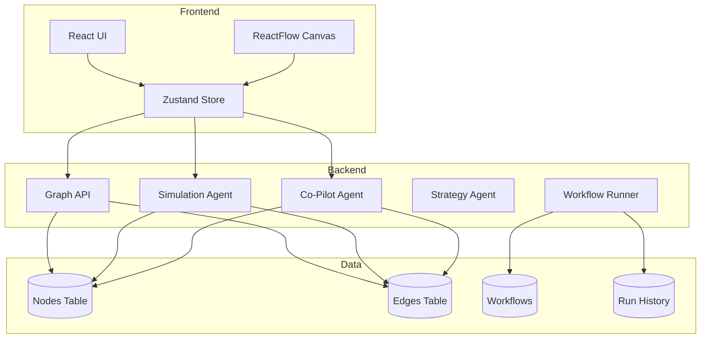
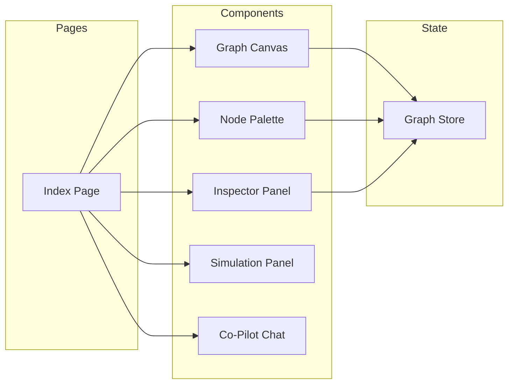
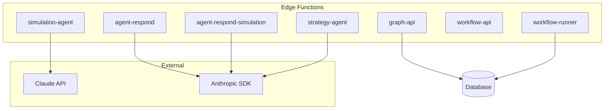
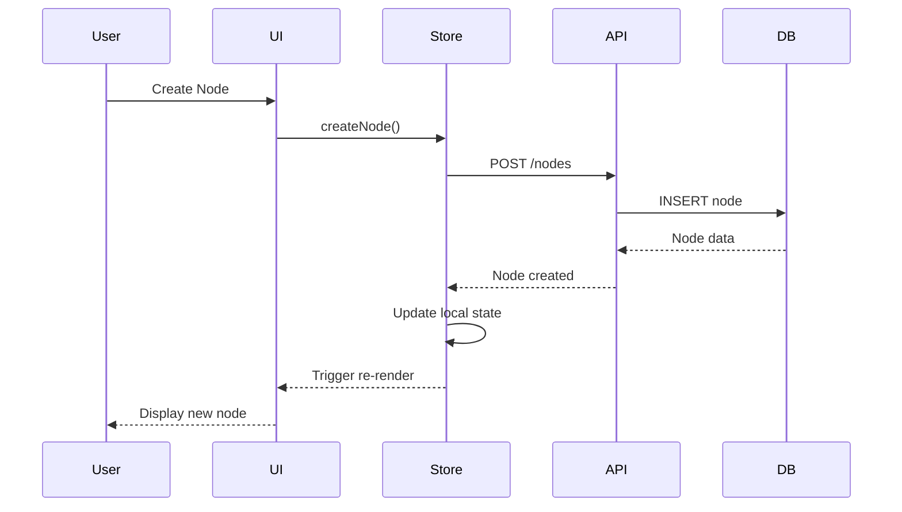
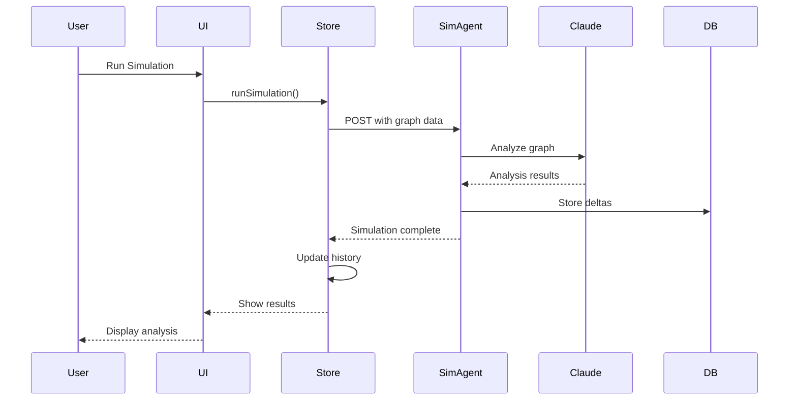
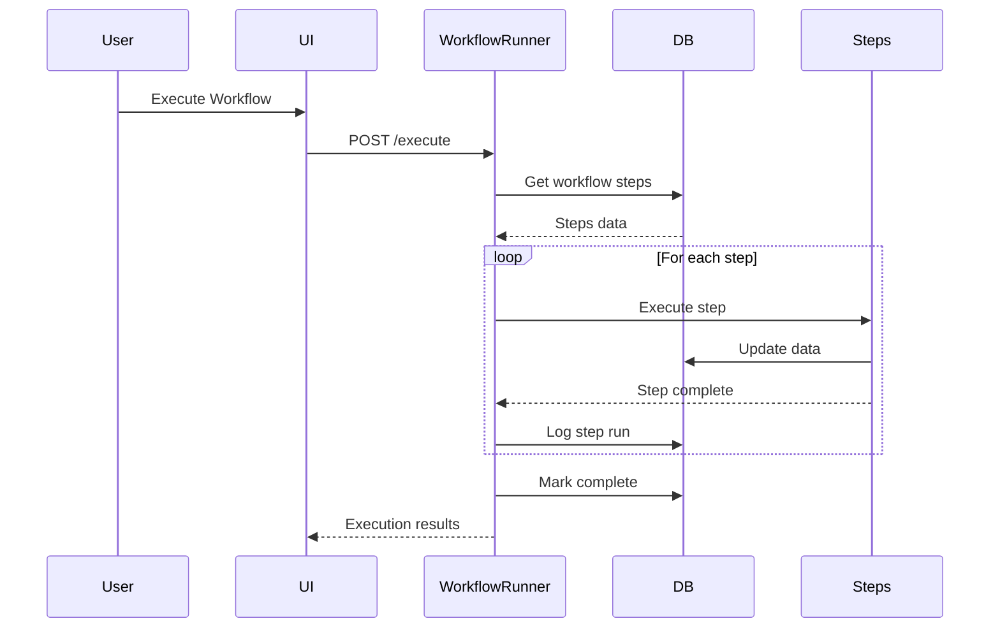
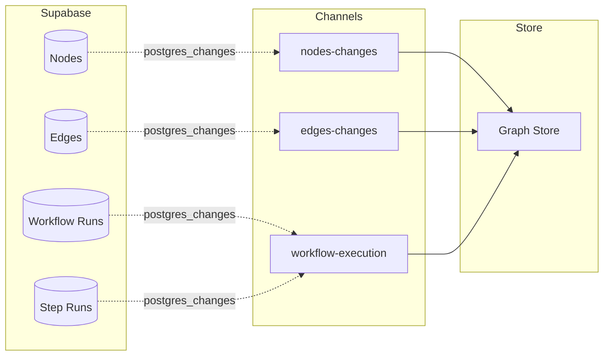
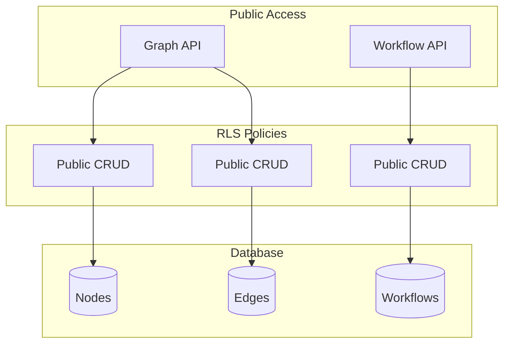
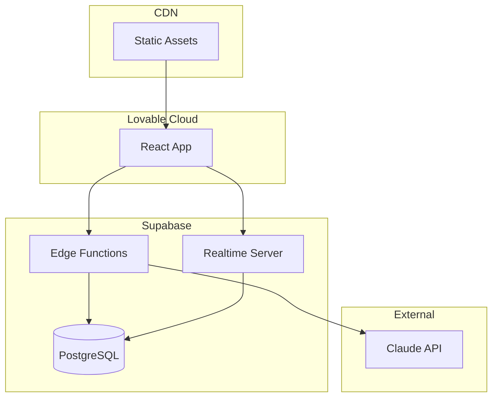
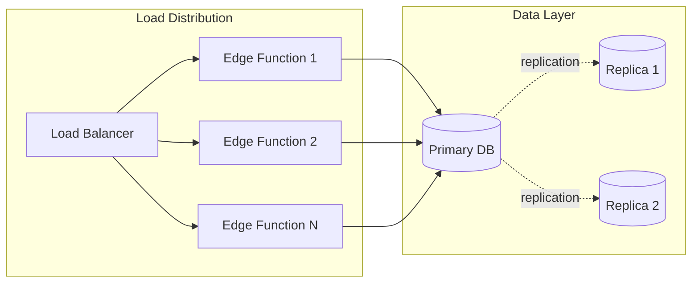

# System Architecture

## Overview

Graph Strategist is a full-stack application built on React, Supabase, and edge computing. It provides a visual interface for strategic planning with AI-powered simulation and automation capabilities.

## High-Level Architecture



## Component Architecture

### Frontend Layer



### Backend Layer



## Data Flow

### Node Creation Flow



### Simulation Flow



### Workflow Execution Flow



## State Management

### Zustand Store Architecture

```mermaid
graph TB
    subgraph Store State
        Nodes[nodes: Node[]]
        Edges[edges: Edge[]]
        Selected[selectedNode: string]
        ActiveRun[activeWorkflowRun: string]
        SimHistory[simulationHistory: Result[]]
    end
    
    subgraph Actions
        Fetch[fetchGraph]
        Create[createNode/Edge]
        Update[updateNode/Position]
        Delete[deleteNode/Edge]
        RunSim[runSimulation]
        Subscribe[subscribeToChanges]
    end
    
    Actions --> Nodes
    Actions --> Edges
    Actions --> Selected
    Actions --> ActiveRun
    Actions --> SimHistory
```

## Real-time Updates

### Subscription Architecture



## Security Architecture

### Authentication & Authorization



> **Note**: Current implementation uses public access for rapid development. Production deployments should implement user authentication and row-level security policies.

## Technology Stack

### Frontend
- **React 18** - UI framework
- **ReactFlow** - Graph visualization
- **Zustand** - State management
- **TailwindCSS** - Styling
- **shadcn/ui** - Component library
- **Vite** - Build tool

### Backend
- **Supabase** - Backend platform
- **PostgreSQL** - Database
- **Edge Functions (Deno)** - Serverless compute
- **Anthropic Claude** - AI capabilities

### Infrastructure
- **Lovable Cloud** - Hosting & deployment
- **Supabase Realtime** - Live updates
- **REST APIs** - Communication layer

## Deployment Architecture



## Performance Considerations

### Optimization Strategies

1. **Debounced Updates**
   - Real-time subscriptions debounce for 500ms
   - Prevents rapid re-fetching during bulk operations

2. **Local State First**
   - Optimistic updates in Zustand store
   - Database persists asynchronously

3. **Efficient Queries**
   - Selective field fetching
   - Indexed lookups on node/edge IDs

4. **Edge Function Caching**
   - Tool results cached within conversation
   - Graph state cached between tool calls

## Scalability

### Horizontal Scaling



### Database Scaling
- Connection pooling via Supavisor
- Read replicas for query distribution
- Partitioning for large node/edge tables
