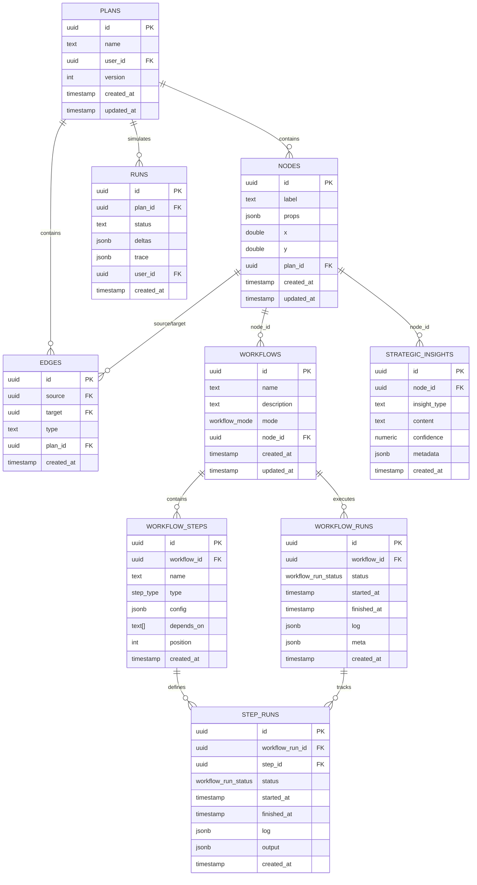
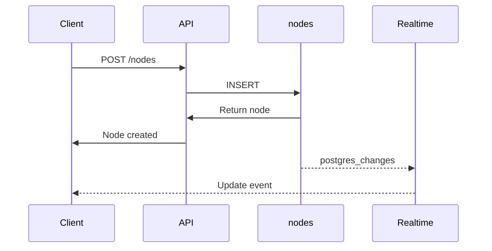
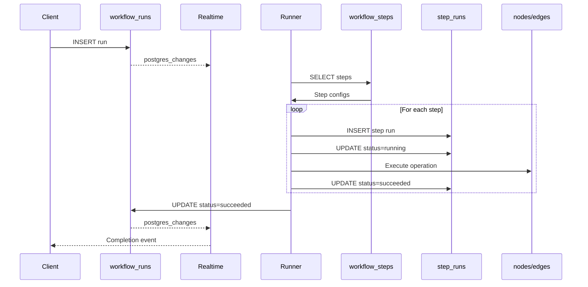
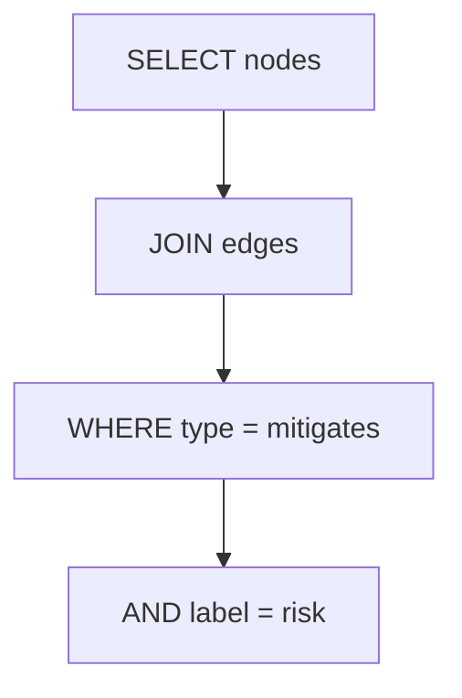
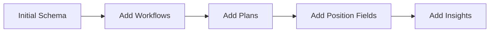

# Database Schema

## Overview

Graph Strategist uses PostgreSQL via Supabase with the following core tables.

## Entity Relationship Diagram



## Table Definitions

### nodes

Stores graph nodes representing strategic elements.

| Column | Type | Nullable | Default | Description |
|--------|------|----------|---------|-------------|
| id | uuid | NO | gen_random_uuid() | Primary key |
| label | text | NO | - | Node type: goal, task, decision, signal, outcome, risk, agent, tool |
| props | jsonb | NO | {} | Node properties (name, description, etc.) |
| x | double precision | YES | 0 | Canvas X position |
| y | double precision | YES | 0 | Canvas Y position |
| plan_id | uuid | YES | - | Associated plan |
| inputs | jsonb | YES | [] | Input connections |
| outputs | jsonb | YES | [] | Output connections |
| context | jsonb | YES | {} | Additional context data |
| created_at | timestamp | YES | now() | Creation timestamp |
| updated_at | timestamp | YES | now() | Last update timestamp |

**Indexes:**
- Primary key on `id`

**RLS Policies:**
- Public read, insert, update, delete access

### edges

Stores relationships between nodes.

| Column | Type | Nullable | Default | Description |
|--------|------|----------|---------|-------------|
| id | uuid | NO | gen_random_uuid() | Primary key |
| source | uuid | NO | - | Source node ID |
| target | uuid | NO | - | Target node ID |
| type | text | NO | - | Relationship: depends_on, leads_to, triggers, branches_to, mitigates, uses |
| plan_id | uuid | YES | - | Associated plan |
| created_at | timestamp | YES | now() | Creation timestamp |

**Indexes:**
- Primary key on `id`
- Index on `source`
- Index on `target`

**RLS Policies:**
- Public read, insert, update, delete access

### plans

Organizes nodes and edges into named plans.

| Column | Type | Nullable | Default | Description |
|--------|------|----------|---------|-------------|
| id | uuid | NO | gen_random_uuid() | Primary key |
| name | text | NO | - | Plan name |
| user_id | uuid | YES | - | Owner user ID |
| version | integer | NO | 1 | Plan version |
| created_at | timestamp | NO | now() | Creation timestamp |
| updated_at | timestamp | NO | now() | Last update timestamp |

**RLS Policies:**
- Users can view their own plans (or public plans with NULL user_id)
- Users can create, update, delete their own plans

### workflows

Defines automated workflow processes.

| Column | Type | Nullable | Default | Description |
|--------|------|----------|---------|-------------|
| id | uuid | NO | gen_random_uuid() | Primary key |
| name | text | NO | - | Workflow name |
| description | text | YES | - | Workflow description |
| mode | workflow_mode | NO | SEQUENTIAL | Execution mode |
| node_id | uuid | YES | - | Associated node |
| created_at | timestamp | NO | now() | Creation timestamp |
| updated_at | timestamp | NO | now() | Last update timestamp |

**Enum: workflow_mode**
- `SEQUENTIAL` - Steps execute in order
- `DAG` - Steps execute based on dependencies

**RLS Policies:**
- Public read, insert, update, delete access

### workflow_steps

Defines individual steps within workflows.

| Column | Type | Nullable | Default | Description |
|--------|------|----------|---------|-------------|
| id | uuid | NO | gen_random_uuid() | Primary key |
| workflow_id | uuid | NO | - | Parent workflow |
| name | text | NO | - | Step name |
| type | step_type | NO | - | Step type |
| config | jsonb | NO | {} | Step configuration |
| depends_on | text[] | YES | [] | Dependent step IDs |
| position | integer | YES | 0 | Step order |
| created_at | timestamp | NO | now() | Creation timestamp |

**Enum: step_type**
- `DELAY` - Wait operation
- `HTTP_REQUEST` - External API call
- `SET_NODE_PROP` - Update node property
- `CREATE_EDGE` - Add edge
- `DELETE_EDGE` - Remove edge
- `SQL_QUERY` - Database query

**RLS Policies:**
- Public read, insert, update, delete access

### workflow_runs

Tracks workflow execution instances.

| Column | Type | Nullable | Default | Description |
|--------|------|----------|---------|-------------|
| id | uuid | NO | gen_random_uuid() | Primary key |
| workflow_id | uuid | NO | - | Executed workflow |
| status | workflow_run_status | NO | queued | Execution status |
| started_at | timestamp | YES | - | Start time |
| finished_at | timestamp | YES | - | Completion time |
| log | jsonb | NO | {} | Execution log |
| meta | jsonb | YES | {} | Additional metadata |
| created_at | timestamp | NO | now() | Creation timestamp |

**Enum: workflow_run_status**
- `queued` - Waiting to start
- `running` - Currently executing
- `succeeded` - Completed successfully
- `failed` - Execution failed

**RLS Policies:**
- Public read, insert, update, delete access

### step_runs

Tracks individual step executions within workflow runs.

| Column | Type | Nullable | Default | Description |
|--------|------|----------|---------|-------------|
| id | uuid | NO | gen_random_uuid() | Primary key |
| workflow_run_id | uuid | NO | - | Parent workflow run |
| step_id | uuid | NO | - | Executed step |
| status | workflow_run_status | NO | queued | Step status |
| started_at | timestamp | YES | - | Start time |
| finished_at | timestamp | YES | - | Completion time |
| log | jsonb | NO | {} | Step log |
| output | jsonb | YES | - | Step output |
| created_at | timestamp | NO | now() | Creation timestamp |

**RLS Policies:**
- Public read, insert, update, delete access

### runs

Stores simulation run history and results.

| Column | Type | Nullable | Default | Description |
|--------|------|----------|---------|-------------|
| id | uuid | NO | gen_random_uuid() | Primary key |
| plan_id | uuid | NO | - | Simulated plan |
| user_id | uuid | YES | - | User who ran simulation |
| status | text | NO | pending | Execution status |
| deltas | jsonb | NO | {} | Suggested changes |
| trace | jsonb | NO | [] | Execution trace |
| created_at | timestamp | NO | now() | Creation timestamp |

**RLS Policies:**
- Users can view their own runs (or public with NULL user_id)
- Users can create their own runs

### strategic_insights

AI-generated insights about nodes and strategies.

| Column | Type | Nullable | Default | Description |
|--------|------|----------|---------|-------------|
| id | uuid | NO | gen_random_uuid() | Primary key |
| node_id | uuid | YES | - | Related node |
| insight_type | text | NO | - | Type of insight |
| content | text | NO | - | Insight content |
| confidence | numeric | YES | - | Confidence score |
| metadata | jsonb | YES | {} | Additional data |
| created_at | timestamp | YES | now() | Creation timestamp |

**RLS Policies:**
- Public read, insert, update, delete access

## Data Flow Patterns

### Node Creation Pattern



### Workflow Execution Pattern



## Querying Patterns

### Get All Nodes with Edges

```sql
SELECT 
    n.*,
    json_agg(
        json_build_object(
            'id', e.id,
            'target', e.target,
            'type', e.type
        )
    ) FILTER (WHERE e.id IS NOT NULL) as outgoing_edges
FROM nodes n
LEFT JOIN edges e ON e.source = n.id
GROUP BY n.id;
```

### Find Critical Path (Longest Chain)

```sql
WITH RECURSIVE path AS (
    -- Start from goals
    SELECT id, label, props, 1 as depth, ARRAY[id] as node_path
    FROM nodes
    WHERE label = 'goal'
    
    UNION ALL
    
    -- Follow dependencies backwards
    SELECT n.id, n.label, n.props, p.depth + 1, p.node_path || n.id
    FROM nodes n
    JOIN edges e ON e.target = n.id
    JOIN path p ON p.id = e.source
    WHERE NOT n.id = ANY(p.node_path) -- Prevent cycles
)
SELECT * FROM path
ORDER BY depth DESC
LIMIT 1;
```

### Get Risks for Goal



```sql
SELECT DISTINCT n.*
FROM nodes n
JOIN edges e_mitigate ON e_mitigate.source = n.id
WHERE n.label = 'risk'
AND e_mitigate.type = 'mitigates'
AND e_mitigate.target IN (
    SELECT source FROM edges WHERE target = $goal_id
);
```

## Migrations

### Creating Tables

All tables are created via Supabase migrations in `supabase/migrations/`.

### Schema Evolution



## Performance Optimization

### Indexes

```sql
-- Node lookups
CREATE INDEX idx_nodes_label ON nodes(label);
CREATE INDEX idx_nodes_plan_id ON nodes(plan_id);

-- Edge traversal
CREATE INDEX idx_edges_source ON edges(source);
CREATE INDEX idx_edges_target ON edges(target);
CREATE INDEX idx_edges_type ON edges(type);

-- Workflow queries
CREATE INDEX idx_workflow_steps_workflow_id ON workflow_steps(workflow_id);
CREATE INDEX idx_workflow_runs_workflow_id ON workflow_runs(workflow_id);
CREATE INDEX idx_step_runs_workflow_run_id ON step_runs(workflow_run_id);
```

### Partitioning Strategy (Future)

For large deployments:

```sql
-- Partition runs by month
CREATE TABLE runs_2025_01 PARTITION OF runs
FOR VALUES FROM ('2025-01-01') TO ('2025-02-01');

CREATE TABLE runs_2025_02 PARTITION OF runs
FOR VALUES FROM ('2025-02-01') TO ('2025-03-01');
```

## Backup & Recovery

### Automated Backups
- Supabase provides automatic daily backups
- Point-in-time recovery available

### Manual Backup

```bash
# Export all data
pg_dump -h db.project.supabase.co -U postgres > backup.sql

# Export specific tables
pg_dump -t nodes -t edges > graph_backup.sql
```

### Restore

```bash
psql -h db.project.supabase.co -U postgres < backup.sql
```
