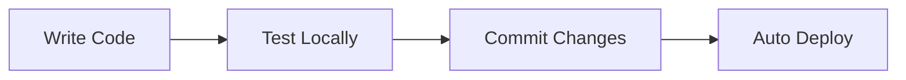

# Development Guide

## Setup

```bash
# Clone repository
git clone <repo-url>
cd graph-strategist

# Install dependencies
npm install

# Start development server
npm run dev
```

## Project Structure

```
graph-strategist/
├── src/
│   ├── components/     # React components
│   ├── pages/          # Page components
│   ├── store/          # Zustand state
│   ├── types/          # TypeScript types
│   └── hooks/          # Custom hooks
├── supabase/
│   ├── functions/      # Edge Functions
│   └── migrations/     # Database migrations
└── docs/               # Documentation
```

## Development Workflow



## Key Technologies

- **React + TypeScript** - Frontend
- **ReactFlow** - Graph visualization
- **Zustand** - State management
- **Supabase** - Backend
- **TailwindCSS** - Styling

## Contributing

1. Create feature branch
2. Make changes
3. Test thoroughly
4. Submit PR

## Testing

```bash
# Run type check
npm run type-check

# Build
npm run build
```

## Deployment

Auto-deployed via Lovable Cloud on push to main branch.
