# User Guide

## Getting Started

Graph Strategist helps you visualize and analyze strategic plans using interactive graphs. This guide will walk you through all the features.

## Interface Overview


### Main Components

1. **Header Bar**
   - Search nodes
   - Auto Layout button
   - Run Simulation button

2. **Left Sidebar**
   - **Palette Tab**: Node types to add
   - **Co-Pilot Tab**: AI assistant

3. **Graph Canvas**
   - Visual workspace
   - Interactive node placement
   - Connection drawing

4. **Right Sidebar**
   - **Details Tab**: Node properties
   - **Simulation Tab**: Analysis results

## Working with Nodes

### Node Types

```mermaid
graph TB
    Goal[⭐ Goal<br/>What you want]
    Task[⚙️ Task<br/>Steps to take]
    Decision[🔀 Decision<br/>Branch points]
    Signal[🔔 Signal<br/>Triggers]
    Outcome[✅ Outcome<br/>Results]
    Risk[⚠️ Risk<br/>Problems]
    Agent[🤖 Agent<br/>AI helpers]
    Tool[🧰 Tool<br/>Apps/Services]
```



### Adding Nodes

**Method 1: Node Palette**
1. Click the **Palette** tab (left sidebar)
2. Click a node type
3. Enter node name
4. Click **Add Node**

**Method 2: Floating Action Button**
1. Click the blue **+** button (bottom right)
2. Select node type
3. Enter node name
4. Click **Add Node**

**Method 3: Co-Pilot**
1. Click the **Co-Pilot** tab
2. Type: "Create a goal called 'Launch Product'"
3. Co-Pilot creates it for you

### Editing Nodes

1. Click a node to select it
2. View details in the **Details** tab (right sidebar)
3. Edit properties:
   - Name
   - Description
   - Priority
   - Status
   - Custom fields

4. Changes auto-save

### Moving Nodes

**Manual Positioning:**
- Click and drag nodes

**Auto Layout:**
1. Click **Auto Layout** in the header
2. Nodes arrange by type automatically

### Deleting Nodes

**Method 1: Keyboard**
1. Click to select a node
2. Press `Delete` or `Backspace`

**Method 2: Inspector**
1. Select the node
2. Use delete option in Details panel

## Working with Edges

### Edge Types


### Creating Connections

1. Hover over a node's edge
2. Click and drag the connection handle
3. Drop on target node
4. Select relationship type:
   - **depends_on** - Task needs another task/goal
   - **leads_to** - Task produces outcome
   - **triggers** - Signal activates task/decision
   - **branches_to** - Decision splits to options
   - **mitigates** - Task reduces risk
   - **uses** - Agent/task uses tool

### Example: Signup Flow

```mermaid
graph TB
    Signal[🔔 New User Signup]
    Validate[⚙️ Validate Data]
    Decision[🔀 Is Premium?]
    Premium[⚙️ Premium Onboarding]
    Free[⚙️ Free Onboarding]
    Goal[⭐ Launch App]
    
    Signal -->|triggers| Validate
    Validate -->|leads_to| Decision
    Decision -->|branches_to| Premium
    Decision -->|branches_to| Free
    Premium -->|depends_on| Goal
    Free -->|depends_on| Goal
```



## Using the Co-Pilot

### What Co-Pilot Can Do

- Create nodes and edges
- Modify existing nodes
- Analyze your graph
- Suggest improvements
- Build complex flows

### Example Commands

**Create Simple Nodes:**
```
Create a goal called "Increase Revenue"
```

**Create Connected Nodes:**
```
Create a signal "user signup" that triggers task "send welcome email"
```

**Create Decision Flow:**
```
Create decision "paid user?" branching to "premium features" or "basic features"
```

**Modify Nodes:**
```
Update the "Launch App" goal to have priority "high"
```

**Build Complete Flows:**
```
Create a user onboarding flow:
- Signal: new user signup
- Task: validate email
- Decision: is premium?
- If yes: premium setup
- If no: basic setup
- Both lead to: onboarding complete
```

### Co-Pilot Conversation Flow


## Running Simulations

### What Simulations Do

Simulations analyze your graph to identify:
- **Bottlenecks** - Single points of failure
- **Critical paths** - Longest execution sequences
- **Risk exposure** - Goals without mitigation
- **Impact analysis** - Downstream effects
- **Recommendations** - Suggested improvements

### How to Run Simulation

1. Click **Run Simulation** (header)
2. Wait for analysis (5-15 seconds)
3. View results in **Simulation** tab (right sidebar)
4. Review recommendations
5. Apply suggested fixes

### Simulation Flow


### Example Simulation Output

**Scenario:** User signup flow

**Findings:**
- ⚠️ **Bottleneck**: "Is Premium?" decision has high convergence
- 🔴 **Risk**: No error handling for validation failure
- 💡 **Recommendation**: Add fallback path for invalid data

## Workflows

### What Are Workflows?

Workflows are automated sequences that execute operations on your graph.

### Workflow Types

**Sequential Mode:**


**DAG Mode (Dependencies):**


### Step Types

- **DELAY** - Wait for duration
- **HTTP_REQUEST** - Call external API
- **SET_NODE_PROP** - Update node property
- **CREATE_EDGE** - Add connection
- **DELETE_EDGE** - Remove connection
- **SQL_QUERY** - Run database query

### Example Workflow

**Onboarding Automation:**
```
Name: "User Onboarding Automation"
Mode: SEQUENTIAL

Steps:
1. SET_NODE_PROP - Mark user as "pending"
2. HTTP_REQUEST - Call email service
3. DELAY - Wait 5 seconds
4. SET_NODE_PROP - Mark user as "active"
5. CREATE_EDGE - Connect to onboarding goal
```

## Searching

### Search Bar Features

1. **Node Name Search**
   - Type node name
   - Matching nodes displayed
   - Graph filters to results

2. **Search Workflow**


## Keyboard Shortcuts

| Action | Shortcut |
|--------|----------|
| Delete selected node | `Delete` or `Backspace` |
| Pan canvas | Click + Drag |
| Zoom in | `Mouse Wheel Up` |
| Zoom out | `Mouse Wheel Down` |
| Reset zoom | Double-click canvas |
| Select node | `Click` |
| Multi-select | `Ctrl/Cmd + Click` |

## Best Practices

### Organizing Your Graph

1. **Use Auto Layout** regularly to maintain structure
2. **Group by type** - Keep similar nodes together
3. **Limit connections** - Avoid node becoming hub
4. **Name clearly** - Use descriptive names
5. **Add descriptions** - Document purpose in details

### Effective Strategy Modeling

```mermaid
graph TB
    Goal[⭐ Clear Goal]
    T1[⚙️ Specific Tasks]
    T2[⚙️ Specific Tasks]
    D1[🔀 Key Decisions]
    O1[✅ Measurable Outcomes]
    R1[⚠️ Known Risks]
    M1[⚙️ Mitigation Tasks]
    
    T1 --> Goal
    T2 --> Goal
    D1 --> T1
    D1 --> T2
    T1 --> O1
    R1 -.blocks.- Goal
    M1 -.mitigates.- R1
```



### Co-Pilot Usage Tips

1. **Be specific**: "Create task 'Send email'" vs "Add email thing"
2. **Build incrementally**: Create nodes first, then connections
3. **Use natural language**: Describe what you want
4. **Review changes**: Check what Co-Pilot created
5. **Iterate**: Refine with follow-up commands

## Common Workflows

### 1. Planning a Project Launch

```mermaid
graph TB
    Goal[⭐ Launch Product]
    T1[⚙️ Design UI]
    T2[⚙️ Build Backend]
    T3[⚙️ Write Tests]
    D1[🔀 Tests Pass?]
    T4[⚙️ Deploy Staging]
    T5[⚙️ Deploy Production]
    O1[✅ Product Live]
    
    T1 --> Goal
    T2 --> Goal
    T3 --> D1
    D1 -->|Yes| T4
    D1 -->|No| T3
    T4 --> T5
    T5 --> O1
```



### 2. Risk Management

```mermaid
graph TB
    Goal[⭐ Secure Launch]
    R1[⚠️ Security Breach]
    R2[⚠️ Server Overload]
    M1[⚙️ Security Audit]
    M2[⚙️ Load Testing]
    M3[⚙️ Auto-scaling]
    
    R1 -.blocks.- Goal
    R2 -.blocks.- Goal
    M1 -.mitigates.- R1
    M2 -.mitigates.- R2
    M3 -.mitigates.- R2
```



### 3. Event-Driven Automation

```mermaid
graph TB
    S1[🔔 User Signup]
    S2[🔔 Payment Success]
    T1[⚙️ Send Welcome Email]
    T2[⚙️ Provision Account]
    T3[⚙️ Enable Premium Features]
    A1[🤖 Email Agent]
    Tool1[🧰 Email Service]
    
    S1 -->|triggers| T1
    S2 -->|triggers| T2
    T2 -->|leads_to| T3
    A1 -->|uses| Tool1
    T1 -.performed_by.- A1
```



## Troubleshooting

### Nodes Not Appearing
- Check search bar isn't filtering
- Refresh with `fetchGraph()`
- Try Auto Layout

### Edges Not Connecting
- Ensure nodes exist
- Check relationship type is valid
- Verify source/target node types match

### Simulation Not Running
- Ensure graph has nodes
- Check network connection
- Review simulation panel for errors

### Co-Pilot Not Responding
- Check conversation history length
- Try rephrasing command
- Use simpler, incremental requests
